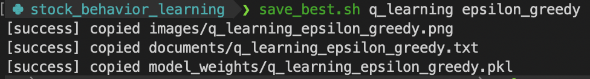

# Stock Behavior Learning

This project implements **multiple reinforcement learning (RL) agents** for stock trading using historical data from Yahoo Finance (yf). It contains both classic RL methods (q-learning and SARSA) and deep RL (Deep Q-Networks, Deep SARSA), with multiple action selection strategies (epsilon-greedy, softmax).

[](./LICENSE)


## Motivation

The idea for this project began when I found myself stuck in a losing position in the stock market——a situation familiar to many investors. Without a solid trading strategy or market knowledge, I realized how easy it was to make emotional decisions.

This experience motivated me to explore whether an **AI agent** could learn to make smarter decisions in buy, sell, or hold based on historical data. By leveraging RL techniques, my goal is to build a system that can help avoid getting "underwater" on investments by providing data-driven choices.

## Table of Contents

- [Features](#features)
- [Project Structure](#project-structure)
- [Installation](#installation)
- [Usage](#usage)
- [Issue](#issue)
- [Contributing](#contributing)
- [License](#license)

## Features

* **Fetch** historical stock data via [yfinance](https://finance.yahoo.com/)

* **Preprocess** stock raw data for RL state

* **Multiple RL Agents:**  
    * q-learning  
    * SARSA  
    * Deep q-learning (DQN)  
    * Deep SARSA  

* **Action Policy:**  
    * Epsilon-Greedy  
    * Softmax method  

* **Performance Evaluation:**  
    <sub>Compares RL agents earning to traditional buy-and-hold strategy</sub>

* **Visualization:**  
    <sub>Plots portfolio values of agents and traditional strategy</sup>

## Project Structure

    .
    ├── README.md
    ├── main.py                 # Main entry point to train or evaluate agent
    ├── best_performance/       # Saved best performance of agents
    ├── packages/               # Source code for agents and policy classes
    ├── LICENSE
    ├── uv.lock                 # Lock file for uv
    ├── pyproject.toml          # Project config
    └── requirements.txt        # Dependency list

## Installation

### Prerequisites

* Python: >=3.12,<<span style="color: gold">3.13</span>  
* (Optional) uv 


### Clone

```sh
# SSH:
git clone git@github.com:StevenHuang41/stock_behavior_learning.git

# or HTTPS:
git clone https://github.com/StevenHuang41/stock_behavior_learning.git
```

### Dependencies

```sh
cd stock_behavior_learning

# pip:
pip install -r requirements.txt

# or uv:
uv sync --locked
```
use uv for faster installation

## Usage

### Train Agents

```sh
python main.py [stock no]
```
Replace `[stock no]` with Yahho Finance ticker (eg. `0050.TW` or `AAPL`)
You can search tickers on [Yahoo Finance](https://finance.yahoo.com/).

Example:  


Finish training process:  


After training finished, it will have three directories created in project root, `images/`, `documents/` and `model_weights/`.

---

### Evaluate Agent Results

There are two ways to see the performance of each agent. 

#### 1. Image Result
```sh
cd images
open [image].png
```
Example:


##

#### 2. Text Result
```sh
cd documents
open [document].txt 
```
Example:


---

### Adjust Hyperparameters

To find the best performance of a stock, you can adjust hyperparameters like learning rate (alpha), discount factor (gamma) and episode in each agent.

- **Classic RL Agent:**
```python
// main.py
# Usage Example for classic RL agent:
class RLAgent(
    stock_no: Literal['stock no'] = "0050.TW",
    len_avg_days: int = 2,
    *,
    policy: Literal['q_learning', 'sarsa'],
    action_policy: Literal['epsilon_greedy', 'softmax_method'],
    alpha: float = 0.001,
    gamma: float = 0.9,
    epsilon: int = 1,
    eps_dec: float = 0.001,
    eps_min: float = 0.1,
    tau: int = 1,
    tau_dec: float = 0.001,
    tau_min: float = 0.3,
    episodes: int = 1000
)

agent = RLAgent(
    stock_no="0050.TW",             # change for image title!
    len_avg_days=len(stock_data),   
    policy='q_learning'             # choose agent policy
    action_policy='epsilon_greedy'  # choose action policy
    alpha=0.001,                    # change as you wish here!
    gamma=0.9,                      # change as you wish here!
    episodes=1000,                  # change as you wish here!
)

agent.train(stock_data)
# or use the best recorded performance 
# agent.load_q_table(load_best=True)

# save image
agent.evaluate_learning(stock_data)

# save document
agent.write_document()
```

##

- **Deep Q-Network Agent:**
```python
// main.py
# Usage Example for Deep Q-Network agent:
class DQNAgent(
    stock_no: str = "0050.TW",
    len_avg_days: int = 2,
    action_policy: EpsilonGreedy | SoftmaxMethod = None,
    apn: Literal['epsilon_greedy', 'softmax_method']='',
    alpha: float = 0.001,
    gamma: float = 0.9,
    episodes: int = 1000,
    batch_size: int = 128,
    hasSecondLayer: bool = False,
    replay_freq: int = 128,
    sync_freq: int = 500
)

deep_agent = [DQNAgent | DsarsaAgent](  # choose agent policy
    stock_no="0050.TW",                 # change for image title!
    len_avg_days=len(avg_days),
    action_policy=EpsilonGreedy(),      # choose action policy
    apn='epsilon_greedy',               # should match the above action policy
    alpha=0.001,                        # change as you wish here!
    gamma=0.9,                          # change as you wish here!
    episodes=10,                        # change as you wish here!
    batch_size=128,                     # change as you wish here!
    hasSecondLayer=False,               # set model to have two layers!
    replay_freq=128,                    # change as you wish here!
    sync_freq=500,                      # change as you wish here!
)

# use 'stock_data_' for deep agent learning
deep_agent.train(stock_data_)
# or use the best recorded performance 
# deep_agent.load_weight(load_best=True)

# save image
deep_agent.evaluate_learning(stock_data_)

# save document
deep_agent.write_document()
```

---

### Save Best Result

If you get best result and want to save it to `best_performance/`, you can use `save_best.sh`



## Issue

1. [ ] yfinance: 
    
    If a stock has split but yfinance does not update this information, then agent will learn without knowing the stock has experienced splitting.

2. [ ] setting avg_days variable

    I have not yet implement the function correctly, deep agent could accept len(avg_days) == 2, because I hardcoded it in evaluate_learning().


## Contributing

1. Fork the repository.
2. Clone your fork to your local machine.
   ```sh
   git clone https://github.com/[your-username/repo-name].git
   cd [repo-name]
   ```
3. Create a new branch
   ```sh
   git switch -c feature-branch
   ```
4. Commit your changes
   ```sh
   git commit -m "Add some feature"
   ```
5. Push to the branch
   ```sh
   git push origin feature-branch
   ```
6. Create a new Pull Request.

## License

This project is licensed under the [MIT License](./LICENSE).  