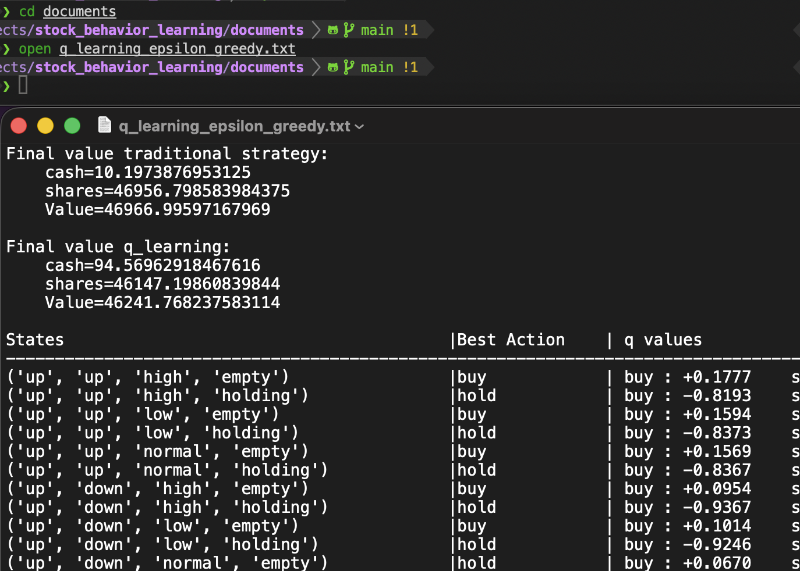

# Stock Behavior Learning

This project implements **multiple reinforcement learning (RL) agents** for stock trading using historical data from Yahoo Finance (yf). It contains both classic RL methods (q-learning and SARSA) and deep RL (Deep Q-Networks, Deep SARSA), with multiple action selection strategies (epsilon-greedy, softmax).

## Overview

- [Features](#features)
- [Installation](#installation)

## Features

* **Fetch** historical stock data via [yfinance](https://finance.yahoo.com/)

* **Preprocess** stock raw data for RL state

* **Multiple RL Agents:**  
    * q-learning  
    * SARSA  
    * Deep q-learning (DQN)  
    * Deep SARSA  

* **Action Policy:**  
    * Epsilon-Greedy  
    * Softmax method  

* **Performance Evaluation:**  
    <sub>Compares RL agents earning to traditional buy-and-hold strategy</sub>

* **Visualization:**  
    <sub>Plots portfolio values of agents and traditional strategy</sup>

## Project Structure

    .
    ├── README.md
    ├── main.py
    ├── best_performance/
    ├── packages/
    ├── LICENSE
    ├── uv.lock
    ├── pyproject.toml
    └── requirements.txt

## Installation

### Prerequisites

* Python: >=3.12,<<span style="color: gold">3.13</span>  
* (Optional) uv 


### Clone

```sh
# SSH:
git clone git@github.com:StevenHuang41/stock_behavior_learning.git

# or HTTPS:
git clone https://github.com/StevenHuang41/stock_behavior_learning.git
```

### Dependencies

```sh
cd stock_behavior_learning

# pip:
pip install -r requirements.txt

# or uv:
uv sync --locked
```
use uv for faster installation

## Usage

### Train Agents

```sh
python main.py [stock no]
```
replace `[stock no]` with your stock number (searchable on yfinance)

Example:  


Finish training process:  


After training finished, it will have three directories created in project root, `images/`, `documents/` and `model_weights/`.

---

### Inspect Results

There are two ways to see the performance of each agent. 

#### 1. Image Result
```sh
cd images
open [image].png
```
Example:


##

#### 2. Text Result
```sh
cd documents
open [document].txt 
```
Example:
